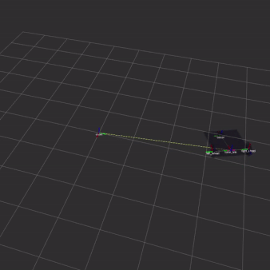
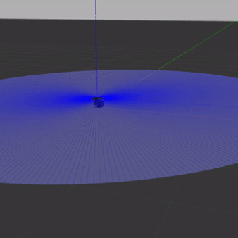
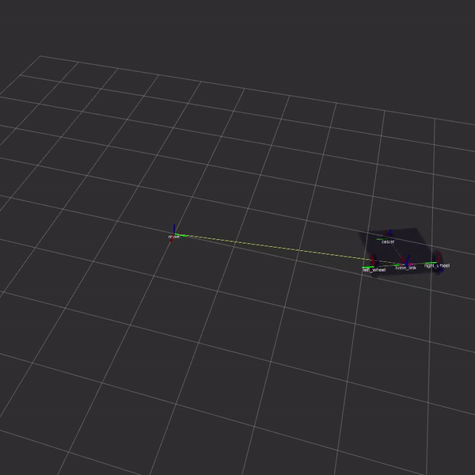
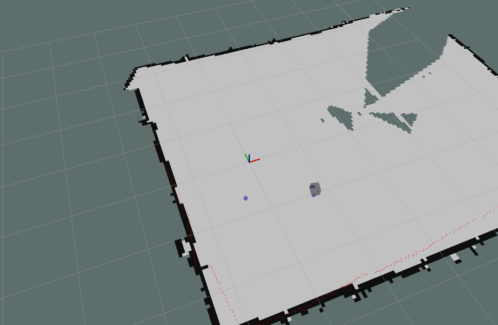

# Navigation Stack 
This is a navigation stack from scratch implemented in ROS for a differential drive robot. I am using the Turtlebot3. I am still working on it at the moment! Professor [Matt Elwin](https://robotics.northwestern.edu/people/profiles/faculty/elwin-matt.html) at Northwestern put together a [course](https://nu-msr.github.io/navigation_site/) for building a navigation stack from scratch. He sketched out what each step should look like and suggested ways of testing. I could not have done it without his guidance, so thanks Matt! I am currently working on implementing Feature-Based Kalman Filtering SLAM. 

# Results So Far
Here are examples of the robot navigating to waypoints in RVIZ, real life, and in Gazebo. More details can be found below.
<table>
  <tr>
    <td>RVIZ Visualization</td>
     <td>Real Hardware</td>
     <td>Gazebo</td>
  </tr>
  <tr>
    <td></td>
    <td></td>
    <td></td>
  </tr>
 </table>

# Rigid2D Library
The first major step of this project was creating a C++ library for representing 2D rigid body transformations. I used screw theory as presented in [Modern Robotics](http://hades.mech.northwestern.edu/images/7/7f/MR.pdf) for 2D frames. The main purpose of this library is to enable us to convert to and from the robot's encoder data and it's rigid body transformations. For example, given that we observed a certain number of encoder ticks per unit time on each wheel, what is the twist that we underwent. What is the SE(2) transformation we will undergo if we follow that for a unit of time? It also lets us take a desired twist and compute what velocities to set for each wheel in order to make the robot follow the given twist in a unit of time. This library facilitates odometry calculations so that higher levels of the navigation stack can abstract them. 

# Visualizing Rigid2D and Robot Geometry in RVIZ
Below is an image from RVIZ of the diff drive robot navigating to 5 waypoints using a feed forward controller. In this case, the waypoints form a pentagon. RVIZ was a very useful tool for both visualzing and testing the rigid2D library.  

# Turtlebot3 Hardware
I am using the Turtlebot3 Burger. Here is a video of the robot following the same pentagon as in the above gif but in real life!!  

# Gazebo Simulation
I wrote a plugin for Gazebo to simulate my differential drive robot. This allows me to iterate faster and avoid using the robot. The plugin listens for wheel commands that are normally sent to the real robot's motors and uses them to update the simulated robot's wheel velocities. The plugin also simulates the encoder and laser data normally published by the real robot. This allows us to have a pretty realistic and dynamic simulation of the robot and its enviroment. 

Below is a video of the robot navigating to waypoints in gazebo using a feedback controller. It also shows RVIZ which displays the robot's internal odometry data. This is where the robot thinks it is. The coordinate axes are not aligned but you can still see that over time, the robot's actual position (the Gazebo simulation) drifts from the idealized position in RVIZ. The RVIZ robot finishes the pentagon at almost exactly the same point it started at. This is visualized by the blue dots. In contrast, the Gazebo robot starts at the origin and finishes about a quarter meter from the origin. This is due to the dynamics of the simulation. RVIZ simply displays the odometry data from the robot. These are purely kinematic calculations. The odometry calculations do not model the robot's inertia, the frictional forces in the enviroment, or any other dynamic quality. Maybe a future iteration could incorporate these types of dynamics in order to obtain better state estimations. In contrast, the Gazebo simulation captures these dynamics and results in a realistic simulation of the robot running in real life. The blue ring is the simulated laser data.  

  

## SLAM
After I graduate, I want to implement Feature-Based Kalman Filtering SLAM on the Turtlebot. In the meantime, I have been using ROS's gmapping package for my SLAM. Below is an image of my Turtlebot running GMapping. A video of the robot navigating to a series of waypoints can be found [here](https://youtu.be/un_52ommASM)  

# Testing 
I used the gtest framework for testing my Rigid2D library. This was extremly helpful for debugging and I will definitely use gtest again! I also used rostest to test that my ROS nodes were being set up correctly. More details about testing can be found in the rigid2d package. 

# Doxygen
I also used Doxygen to generate documentation of files, classes, and methods. The Doxygen documentation is available [here](https://peterjochem.github.io/Turtlebot_Navigation/html/index.html). 

# ROS Packages
I implemented a few ROS packages for this project. Below is a quick description of each. More details can be found in the README.md for each package. 

## tsim
This package was mainly for visualizing the commands I was sending to the robot in the early stages of the project. It has a FeedForward controller node which I used to make a simulated, kinematic robot rotate, translate, and navigate to waypoints. The simulation is from the ROS developers and includes a GUI to visualize the commands being sent to the robot and how it would move, kinematically.

## rigid2d 
This package implements rigid body calculations that are useful for odometry. The src/rigid2D/config folder also has derivations of the robot's equations of motion. 

## nuturtle_description 
This package contains descriptions of the robot's geometry and urdf. 

## nuturtle_gazebo 
This contains the Gazebo plugin and another urdf for the Gazebo simulation. The extra urdf includes the original urdf and then adds the extra data required for Gazebo, such as inertias and frictional coefficients. This also has a node implementing a feedback controller. 

## nuturtle_robot 
This package has nodes which bridge the gap between the higher level control and the lower level interactions with the motors and other hardware. These extra nodes make it much easier to swap out the real robot for a simulated robot in Gazebo.  

### Notes to Self 
Remember to put this into the devel/setup.bash  
export ROS_MASTER_URI=http://192.168.1.100:11311  
export ROS_IP=192.168.1.100

