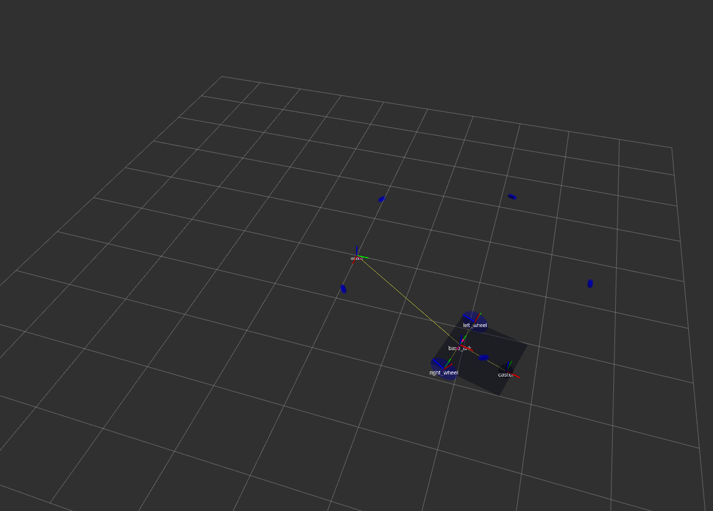

# Hello! 
This is a navigation stack built with ROS for a differential drive robot. I am still working on it at the moment! Professor Matt Elwin at Northwestern put together a [course] (https://nu-msr.github.io/navigation_site/) for building such a software stack. He sketched out what each step should look like and suggested ways of testing. He did not provide any code but did provide a few suggested method signatures. 
Below is an image from RVIZ of the diff drive robot navigating to 5 waypoints. In this case, the waypoints form a pentagon

