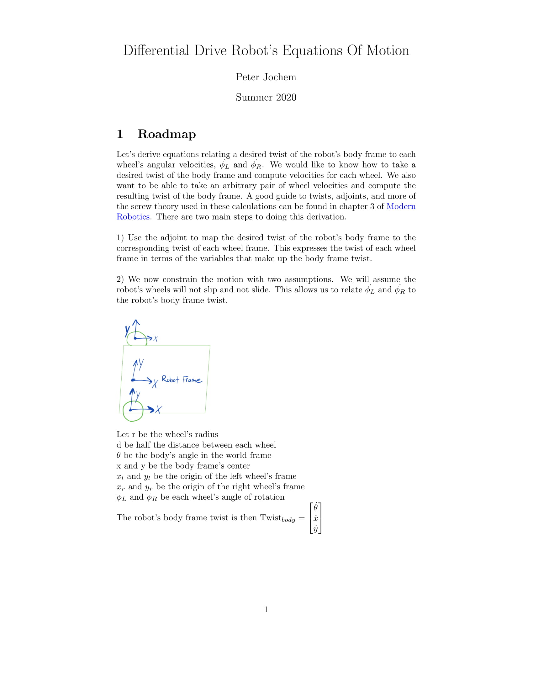
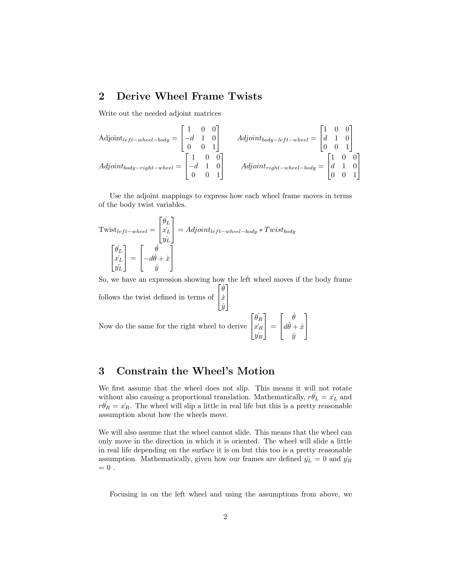
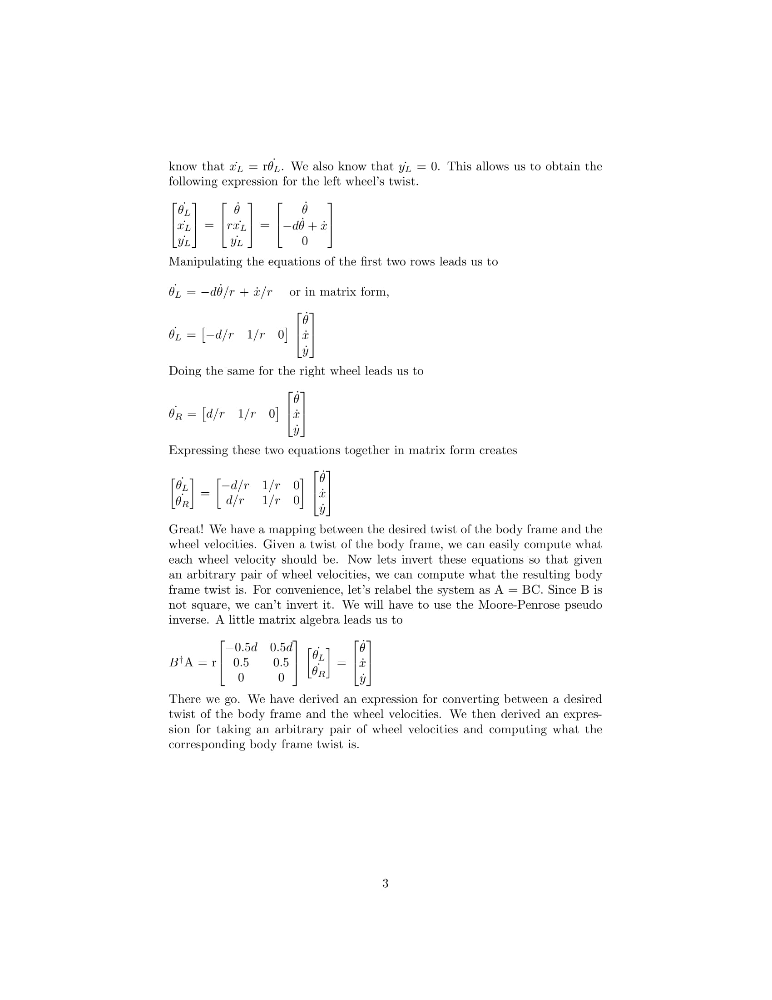

# Rigid2D Package
The first major step of this project was creating a C++ library for representing 2D rigid body transformations. I used screw theory as presented in [Modern Robotics](http://hades.mech.northwestern.edu/images/7/7f/MR.pdf) for 2D frames. The main purpose of this library is to enable us to convert to and from the robot's encoder data and it's rigid body transformations. For example, given that we observed a certain number of encoder ticks per unit time on each wheel, what is the twist that we underwent. What is the SE(2) transformation we will undergo if we follow that for a unit of time? It also lets us take a desired twist and compute what velocities to set for each wheel in order to make the robot follow the given twist in a unit of time. This library facilitates odometry calculations so that higher levels of the navigation stack can abstract them. 

# Rigid2D Library 

### rigid2d.cpp  
This implements the rigid body transoformations as well as the screw theory calculations.  

### diff_drive.cpp  
This provides a class for modeling a differential drive robot. It has fields for tracking the robot's current SE(2) pose as well as other odometry data.

### waypoints.cpp
This provides methods for a robot to navigate to waypoints. It subscribes to a list of waypoints on the ROS server and provides methods for navigating to them.   

# ROS Nodes 

### fake_diff_encoders_node.cpp 
This node publishes fake encoder data so that we can run the robot in RVIZ without setting up the real robot.

### odometer_node.cpp
This node provides tracking and updating of a robot's odometry from published encoder data. 

# Equations of Motion
Below is a derivation of the robot's kinematic equations of motion. We want to derive equations relating a desired twist in the robot's body frame to the wheel's angular velocities. We want to know how to control the wheels in order to achieve a given twist of the body frame. We also want to know, given arbitrary wheel velocities, what twist is followed by the body frame. These calculations are purely kinematic. I never modeled the robot's dynamic qualities but a next step might be to do so.  

